---
# Configurações do Slidev / Cabeçalho Global
routerMode: hash
theme: default
background: https://images.unsplash.com/photo-1555066931-4365d14bab8c?auto=format&fit=crop&w=1920&q=80
class: text-center
highlighter: shiki
lineNumbers: true
drawings:
  enabled: true
transition: slide-left
title: "Aula 01: Fundamentos de Programação"
info: |
  ## Template de Slidev para Aulas de Código
  Criado para professores e instrutores de tecnologia.
---

# Estrutura de Dados & Algoritmos

Desenvolvendo Código Limpo e Eficiente em TypeScript

<div class="pt-12">
  <span @click="$slidev.nav.next" class="px-6 py-3 rounded-full cursor-pointer bg-emerald-500 bg-opacity-20 hover:bg-opacity-30 transition border border-emerald-500/50">
    Pressione barra de espaço para começar <carbon:arrow-right class="inline"/>
  </span>
</div>

<div class="abs-br m-6 flex gap-2 font-mono text-sm opacity-75">
  <span>Prof. Seu Nome</span> | <span>Módulo 1</span>
</div>

<!--
Notas do Instrutor:
- Boas-vindas aos alunos.
- Lembrar de gravar a aula se for online.
- Ativar o modo de desenho (D) se precisar fazer anotações na tela.
-->

---
transition: fade-out
layout: default
---

# 📋 Agenda da Aula de Hoje

O que vamos aprender no encontro de hoje:

<div class="grid grid-cols-2 gap-6 mt-8">
  <div class="p-4 rounded-lg bg-gray-800/50 border border-gray-700">
    <h3 class="text-emerald-400 font-bold mb-2 flex items-center gap-2">
      <carbon:code /> 1. Conceitos Fundamentais
    </h3>
    <p class="text-sm opacity-80">Tipagem estática, imutabilidade e escopo de variáveis no TypeScript.</p>
  </div>

  <div class="p-4 rounded-lg bg-gray-800/50 border border-gray-700">
    <h3 class="text-sky-400 font-bold mb-2 flex items-center gap-2">
      <carbon:flow /> 2. Fluxo de Execução
    </h3>
    <p class="text-sm opacity-80">Visualização em diagrama do ciclo de vida de uma requisição.</p>
  </div>

  <div class="p-4 rounded-lg bg-gray-800/50 border border-gray-700">
    <h3 class="text-amber-400 font-bold mb-2 flex items-center gap-2">
      <carbon:compare /> 3. Refatoração & Clean Code
    </h3>
    <p class="text-sm opacity-80">Comparação prática: Códigos ruins vs. Boas práticas.</p>
  </div>

  <div class="p-4 rounded-lg bg-gray-800/50 border border-gray-700">
    <h3 class="text-purple-400 font-bold mb-2 flex items-center gap-2">
      <carbon:terminal /> 4. Desafio Prático
    </h3>
    <p class="text-sm opacity-80">Exercício hands-on para fixação do conhecimento.</p>
  </div>
</div>

---
layout: default
---

# 💡 Conceito: Tipagem e Interfaces

Interfaces definem o contrato para objetos em nossa aplicação.

<v-clicks>

- 🛡️ **Segurança em tempo de compilação:** Evita erros comuns de *undefined* ou *null*.
- 📖 **Documentação viva:** O próprio editor fornece autocomplete e auto-documentação.
- 🧱 **Reutilização:** Podem ser estendidas ou compostas para criar estruturas complexas.

</v-clicks>

<div v-click class="mt-6 p-4 bg-emerald-950/40 border-l-4 border-emerald-500 rounded-r text-sm">
  <strong>Dica do Professor:</strong> Sempre prefira declarar interfaces para contratos públicos da sua API.
</div>

---
layout: default
---

# 🧑‍💻 Exemplo Prático: Animação de Código Passo a Passo

Use os botões de navegação para avançar no código linha por linha:

```ts {all|1-6|8-12|14-20|all}
// 1. Definição da Interface do Usuário
interface User {
  id: number;
  name: string;
  role: 'admin' | 'student';
}

// 2. Função de validação
function isAdmin(user: User): boolean {
  return user.role === 'admin';
}

// 3. Execução e teste
const currentUser: User = {
  id: 101,
  name: "Ana Silva",
  role: "student"
};

console.log(`É admin? ${isAdmin(currentUser)}`);

```

---
layout: two-cols-header
layoutClass: gap-8
---

# ⚔️ Comparando Códigos (Refatoração)

Veja a diferença entre um código confuso e uma versão limpa:

::left::

### ❌ Mau Exemplo (Antigo)

```ts
function process(u: any) {
  if (u.a == 1) {
    if (u.status == 'A') {
      return true;
    } else {
      return false;
    }
  }
  return false;
}

```

::right::

### ✅ Bom Exemplo (Refatorado)

```ts
interface Account {
  isAdmin: boolean;
  isActive: boolean;
}

function isAccountValid(account: Account): boolean {
  return account.isAdmin && account.isActive;
}

```

---
layout: default
---

# 📐 Arquitetura do Sistema (Diagrama)

Podemos desenhar fluxos diretamente usando Markdown com Mermaid:

```mermaid
graph TD
    A[Cliente / Frontend] -->|1. HTTP POST /login| B[API Gateway]
    B -->|2. Valida Token| C[Serviço de Autenticação]
    C -->|3. Consulta Usuário| D[(Banco de Dados PostgreSQL)]
    D -->|4. Retorna Dados| C
    C -->|5. Gera JWT| B
    B -->|6. Resposta 200 OK + Token| A

    style A fill:#1e293b,stroke:#38bdf8,stroke-width:2px
    style C fill:#1e293b,stroke:#34d399,stroke-width:2px
    style D fill:#1e293b,stroke:#f87171,stroke-width:2px
```



---
layout: default
---

# 🚀 Desafio Prático para os Alunos

```ts
interface Student {
  name: string;
  grade: number;
}

// TODO: Implemente a função abaixo
function getApprovedStudents(students: Student[]): string[] {
  // Sua solução aqui...
}

```

---
layout: default
---

# ❓ Quiz de Fixação

---
layout: default
---

# 📚 Recursos Adicionais e Links

Para aprofundar seus estudos após a aula:

---
layout: default
class: text-center
---

# Obrigado pela atenção! 🎉


---
layout: two-cols
layoutClass: gap-8
---

# Coluna da Esquerda

Conteúdo ou explicação do lado esquerdo.

- Suporte completo a **Markdown**
- Estilização rápida via Tailwind CSS
- Animação simples de itens

::right::

# Coluna da Direita

Conteúdo complementar ou imagem do lado direito.

```js
// Exemplo rápido no lado direito
const status = "Pronto";
console.log(`Estado: ${status}`);

```

---

# Destaque Dinâmico de Código

Navegue linha por linha utilizando as etapas de visualização:

```typescript {1-3|5-8|10-12|all}
// Etapa 1: Definição de interface
interface Projeto {
  nome: string;
  versao: number;
}

// Etapa 2: Instanciação
const meuProjeto: Projeto = {
  nome: "Slidev Docs",
  versao: 1.0
};

// Etapa 3: Execução
console.log(meuProjeto.nome);

```

---

# Animações de Elementos (`v-click`)

Exiba tópicos um a um conforme você clica nos slides:

---

# Fórmulas Matemáticas (KaTeX)

Você pode renderizar equações complexas nativamente:

$$\mathcal{L}\{f(t)\} = F(s) = \int_{0}^{\infty} f(t) e^{-st} \, dt$$

E alinhar equações inline como $E = mc^2$.

$$\mathcal{L}\{f(t)\} = F(s) = \int_{0}^{\infty} f(t) e^{-st} \, dt$$

---
layout: center
class: text-center
---

# Perguntas & Respostas

Obrigado pela atenção!

[Documentação do Slidev](https://sli.dev/) · [GitHub](https://github.com/slidevjs/slidev)

```
