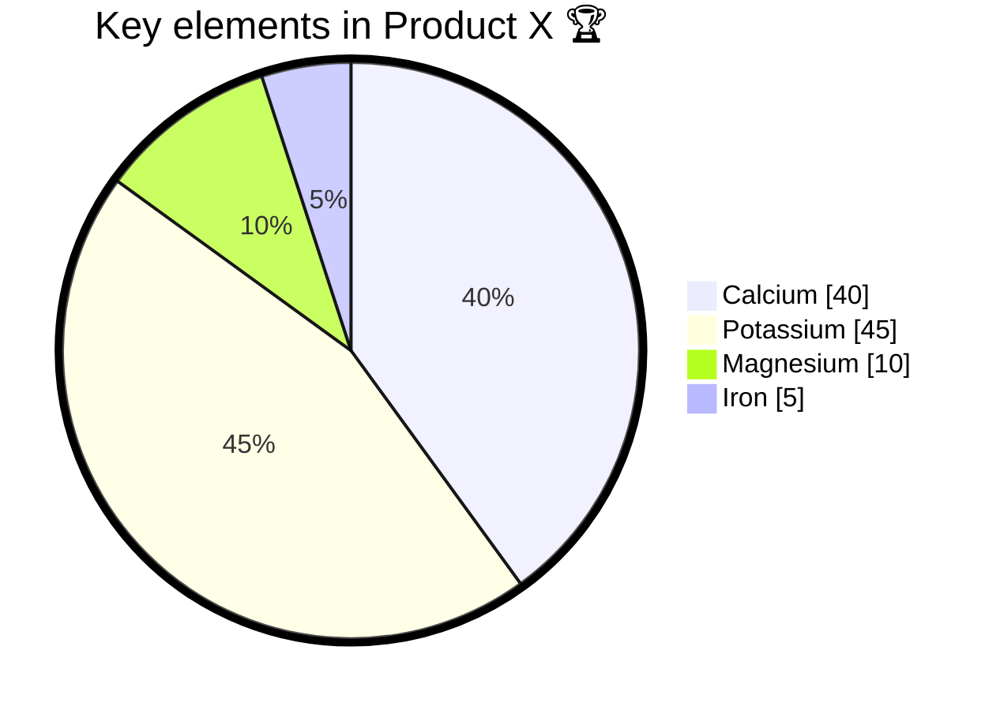
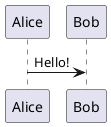

---
# Configurações do Slidev / Cabeçalho Global
routerMode: hash
theme: default
background: https://images.unsplash.com/photo-1555066931-4365d14bab8c?auto=format&fit=crop&w=1920&q=80
class: text-center
highlighter: shiki
lineNumbers: true
drawings:
  enabled: true
transition: slide-left
title: "Aula 01: Fundamentos de Programação"
info: |
  ## Template de Slidev para Aulas de Código
  Criado para professores e instrutores de tecnologia.
---

# Estrutura de Dados & Algoritmos

Desenvolvendo Código Limpo e Eficiente em TypeScript

<div class="pt-12">
  <span @click="$slidev.nav.next" class="px-6 py-3 rounded-full cursor-pointer bg-emerald-500 bg-opacity-20 hover:bg-opacity-30 transition border border-emerald-500/50">
    Pressione barra de espaço para começar <carbon:arrow-right class="inline"/>
  </span>
</div>

<div class="abs-br m-6 flex gap-2 font-mono text-sm opacity-75">
  <span>Prof. Adriano Ruseler</span> | <span>Aula 00</span>
</div>

<!--
Notas do Instrutor:
- Boas-vindas aos alunos.
- Lembrar de gravar a aula se for online.
- Ativar o modo de desenho (D) se precisar fazer anotações na tela.
-->

---
transition: fade-out
layout: default
---

# 📋 Agenda da Aula de Hoje

O que vamos aprender no encontro de hoje:

<div class="grid grid-cols-2 gap-6 mt-8">
  <div class="p-4 rounded-lg bg-gray-800/50 border border-gray-700">
    <h3 class="text-emerald-400 font-bold mb-2 flex items-center gap-2">
      <carbon:code /> 1. Conceitos Fundamentais
    </h3>
    <p class="text-sm opacity-80">Tipagem estática, imutabilidade e escopo de variáveis no TypeScript.</p>
  </div>

  <div class="p-4 rounded-lg bg-gray-800/50 border border-gray-700">
    <h3 class="text-sky-400 font-bold mb-2 flex items-center gap-2">
      <carbon:flow /> 2. Fluxo de Execução
    </h3>
    <p class="text-sm opacity-80">Visualização em diagrama do ciclo de vida de uma requisição.</p>
  </div>

  <div class="p-4 rounded-lg bg-gray-800/50 border border-gray-700">
    <h3 class="text-amber-400 font-bold mb-2 flex items-center gap-2">
      <carbon:compare /> 3. Refatoração & Clean Code
    </h3>
    <p class="text-sm opacity-80">Comparação prática: Códigos ruins vs. Boas práticas.</p>
  </div>

  <div class="p-4 rounded-lg bg-gray-800/50 border border-gray-700">
    <h3 class="text-purple-400 font-bold mb-2 flex items-center gap-2">
      <carbon:terminal /> 4. Desafio Prático
    </h3>
    <p class="text-sm opacity-80">Exercício hands-on para fixação do conhecimento.</p>
  </div>
</div>

---
layout: default
---

# 💡 Conceito: Tipagem e Interfaces

Interfaces definem o contrato para objetos em nossa aplicação.

<v-clicks>

- 🛡️ **Segurança em tempo de compilação:** Evita erros comuns de *undefined* ou *null*.
- 📖 **Documentação viva:** O próprio editor fornece autocomplete e auto-documentação.
- 🧱 **Reutilização:** Podem ser estendidas ou compostas para criar estruturas complexas.

</v-clicks>

<div v-click class="mt-6 p-4 bg-emerald-950/40 border-l-4 border-emerald-500 rounded-r text-sm">
  <strong>Dica do Professor:</strong> Sempre prefira declarar interfaces para contratos públicos da sua API.
</div>

---
layout: default
---

# 🧑‍💻 Exemplo Prático: Animação de Código Passo a Passo

Use os botões de navegação para avançar no código linha por linha:

```ts {all|1-6|8-12|14-20|all} 
// 1. Definição da Interface do Usuário
interface User {
  id: number;
  name: string;
  role: 'admin' | 'student';
}

// 2. Função de validação
function isAdmin(user: User): boolean {
  return user.role === 'admin';
}

// 3. Execução e teste
const currentUser: User = {
  id: 101,
  name: "Ana Silva",
  role: "student"
};

console.log(`É admin? ${isAdmin(currentUser)}`);

```

---
layout: two-cols-header
layoutClass: gap-8
---

# ⚔️ Comparando Códigos (Refatoração)

Veja a diferença entre um código confuso e uma versão limpa:

::left::

### ❌ Mau Exemplo (Antigo)

```ts
function process(u: any) {
  if (u.a == 1) {
    if (u.status == 'A') {
      return true;
    } else {
      return false;
    }
  }
  return false;
}

```

::right::

### ✅ Bom Exemplo (Refatorado)

```ts
interface Account {
  isAdmin: boolean;
  isActive: boolean;
}

function isAccountValid(account: Account): boolean {
  return account.isAdmin && account.isActive;
}

```

---
layout: default
---

# 🔬 Key elements in Product X (Mermaid)
📚🔬🔎🥼⚡📐⚙️
Podemos desenhar fluxos diretamente usando Markdown com Mermaid:



---
layout: default
---

# 📐 PlantUML Diagrams 

You can create PlantUML diagrams easily in your slides, for example:

## plantuml



---
layout: default
---

# 🚀 Desafio Prático para os Alunos

```ts
interface Student {
  name: string;
  grade: number;
}

// TODO: Implemente a função abaixo
function getApprovedStudents(students: Student[]): string[] {
  // Sua solução aqui...
}

```

---
layout: default
---

# ❓ Quiz de Fixação

---
layout: default
---

# 📚 Recursos Adicionais e Links

Para aprofundar seus estudos após a aula:

---
layout: default
class: text-center
---

# Obrigado pela atenção! 🎉


---
layout: two-cols
layoutClass: gap-8
---

# Coluna da Esquerda

Conteúdo ou explicação do lado esquerdo.

- Suporte completo a **Markdown**
- Estilização rápida via Tailwind CSS
- Animação simples de itens

::right::

# Coluna da Direita

Conteúdo complementar ou imagem do lado direito.

```js
// Exemplo rápido no lado direito
const status = "Pronto";
console.log(`Estado: ${status}`);

```

---

# Destaque Dinâmico de Código

Navegue linha por linha utilizando as etapas de visualização:

```typescript {1-3|5-8|10-12|all}
// Etapa 1: Definição de interface
interface Projeto {
  nome: string;
  versao: number;
}

// Etapa 2: Instanciação
const meuProjeto: Projeto = {
  nome: "Slidev Docs",
  versao: 1.0
};

// Etapa 3: Execução
console.log(meuProjeto.nome);

```

---

# Animações de Elementos (`v-click`)

Exiba tópicos um a um conforme você clica nos slides:

---

# Fórmulas Matemáticas (KaTeX)

Você pode renderizar equações complexas nativamente:

$$\mathcal{L}\{f(t)\} = F(s) = \int_{0}^{\infty} f(t) e^{-st} \, dt$$

E alinhar equações inline como $E = mc^2$.

$$\mathcal{L}\{f(t)\} = F(s) = \int_{0}^{\infty} f(t) e^{-st} \, dt$$

---
layout: center
class: text-center
---

# Perguntas & Respostas

Obrigado pela atenção!

[Documentação do Slidev](https://sli.dev/) · [GitHub](https://github.com/slidevjs/slidev)

---

# Imagens no Slidev 🎨
## Posicionamento, SVG Inline e Classes CSS/Tailwind

<div class="pt-12">
  <span class="px-4 py-2 rounded-lg bg-emerald-500/20 border border-emerald-500/40 text-emerald-300">
    Pressione <kbd>espaço</kbd> para navegar
  </span>
</div>

---

# 1. Inclusão Básica de PNG & SVG

O Slidev aceita sintaxe nativa do Markdown ou tags HTML `` para melhor controle de dimensões.

<div class="grid grid-cols-2 gap-6 mt-6">

  <div class="p-4 bg-slate-800/60 rounded-lg border border-slate-700 text-center">
    <h3 class="mb-3 font-semibold text-sky-400">Imagem PNG (via HTML)</h3>
    <!-- Imagem local em ./public/logo.png ou URL remota -->
    
    <p class="text-xs text-gray-400 mt-4">Uso de <code>class="h-32 mx-auto"</code> para altura e centralização</p>
  </div>

  <div class="p-4 bg-slate-800/60 rounded-lg border border-slate-700 text-center">
    <h3 class="mb-3 font-semibold text-emerald-400">Vetor SVG (via Tag File)</h3>
    <!-- Imagem SVG vinda de URL ou pasta local -->
    
    <p class="text-xs text-gray-400 mt-4">SVGs em tag <code>&lt;img&gt;</code> mantêm excelente nitidez em qualquer zoom</p>
  </div>

</div>

---

# 2. Posicionamento Absoluto (Pins & Badges)

Você pode posicionar imagens/ícones em qualquer canto do slide usando utilitários nativos como `abs-tl`, `abs-tr`, `abs-bl`, `abs-br`.

<!-- Logo no canto superior direito -->
<div class="abs-tr m-6 flex items-center gap-2 bg-slate-800/80 px-3 py-1.5 rounded-full border border-slate-700">
  
  <span class="text-xs font-mono">UTFPR / DAINF</span>
</div>

<!-- Imagem decorativa no canto inferior esquerdo -->
<div class="abs-bl m-6 opacity-30 hover:opacity-100 transition">
  
</div>

<div class="mt-8">
  <p class="text-lg">Exemplo de conteúdo principal do slide.</p>
  <p class="text-sm opacity-70">Observe a marca d'água/badge fixada no topo direito e no canto inferior esquerdo!</p>
</div>

```html
<!-- Canto superior direito (Top-Right) -->
<div class="abs-tr m-6">
  
</div>

<!-- Canto inferior direito (Bottom-Right) -->
<div class="abs-br m-6">
  
</div>

```

---
layout: two-cols
layoutClass: gap-8 items-center
---

::left::
# 3. Alinhamento Lado a Lado (Grids)

Posicionando imagens lado a lado com texto em colunas.

* Usa o layout nativo `two-cols`
* Centralização vertical com `items-center`
* Ajuste de proporção com `object-cover` ou `object-contain`

::right::

# 4. SVG Inline (Estilização via CSS/Tailwind)

Em vez de usar ``, colar o SVG direto no Markdown permite alterar suas cores com Tailwind (`fill-current`, `text-*`):

---

# 5. Ícones Integrados (UnoCSS / Carbon Icons)

No Slidev você também pode usar milhares de ícones vetoriais em SVG sem precisar baixar nenhum arquivo:

---

### 💡 Principais Dicas de Posicionamento no Slidev:

1. **Pastas para Imagens Locais**:
* Coloque suas imagens na pasta **`public/`** na raiz do projeto (ex: `public/imagens/microcontrolador.png`).
* No slide, refira-se a elas iniciando pela barra raiz: ``.


2. **Classes Utilitárias de Posicionamento Absoluto**:
* `abs-tl`: Canto Superior Esquerdo (Top-Left)
* `abs-tr`: Canto Superior Direito (Top-Right)
* `abs-bl`: Canto Inferior Esquerdo (Bottom-Left)
* `abs-br`: Canto Inferior Direito (Bottom-Right)


3. **Controle de Dimensões & Ajustes CSS (Tailwind)**:
* **Largura/Altura**: `w-32` (largura fixada), `h-16` (altura fixada), `w-full` (100% da largura).
* **Ajuste de Aspect Ratio**: `object-cover` (corta para preencher o container sem distorcer) ou `object-contain` (mantém proporção original sem cortar).
* **Centralização**: `mx-auto` (para elementos em bloco) ou `flex justify-center items-center` no elemento pai.


---

# Slide Title

Here is an embedded video:

<Youtube id="nleqgO38pPU" />

---

# Customizing Video Appearance & Behavior

You can control dimensions, aspect ratio, or start time using props:

<Youtube 
  id="nleqgO38pPU" 
  width="600" 
  height="340"
  start="0"
/>

---

# Customizing Video Appearance & Behavior

<iframe width="560" height="315" src="https://www.youtube.com/embed/nleqgO38pPU?si=KAOBOD0bYy7A_e32" title="YouTube video player" frameborder="0" allow="accelerometer; autoplay; clipboard-write; encrypted-media; gyroscope; picture-in-picture; web-share" referrerpolicy="strict-origin-when-cross-origin" allowfullscreen></iframe>
